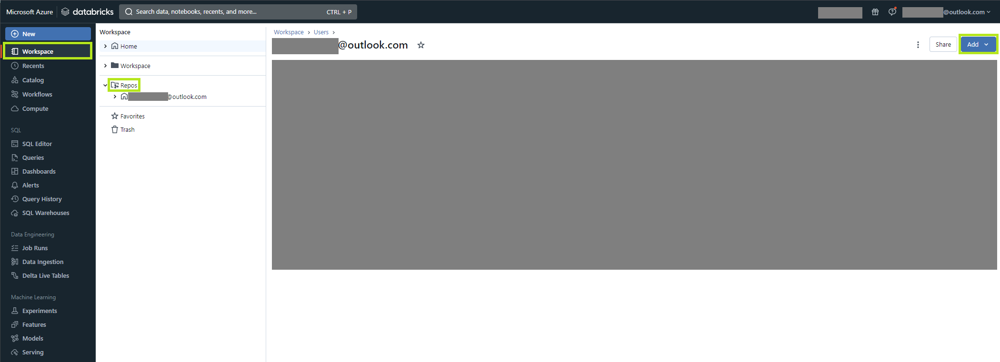
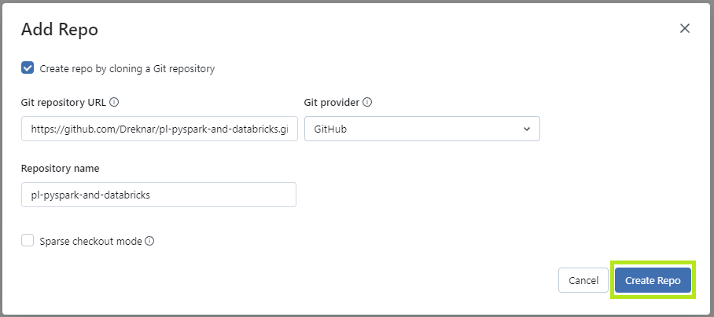

# [PL] Pyspark and Databricks

Repozytorium zawiera zestaw informacji związanych z nauką technologii PySpark wykorzystując narzędzie Databricks (w tym przypadku implementacją z pomocą MS Azure).

## Struktura

Repozytorium zawiera zestaw notebooków oraz danych niezbędnych do uruchomienia ich w Databricksie. Repozytorium jest podzielone na dwa katalogi:

- **data** zawierające przykładowe zbiory danych pobrane z otwartych źródeł jak np. Kaggle czy Data World.
- **notebooks** w którym znajdują się notebooki Databricks. Wszystkie notatniki posiadają rozszerzenie ```.py```.

## Dodawanie repozytorium do Databricks

Po zalogowaniu się do Databricks wybieramy opcję _Workspace_, a następnie z nowego okna _Repos_. Jeżeli będzie to nasze pierwsze repozytorium w systemie to na środku pojawi się komunikat z opcją _Add repo_. W przeciwnym razie (czyli widzimy nasz katalog domowy) wybieramy opcję nasz katalog domowy, potem _Add_, a następnie _Add repo_.



Pojawi się nowe konto w którym podajemy URL do klonowania naszego repozytorium. Provider powinien zostać ustawiony automatycznie na _Github_, natomiast zaproponowana nazwa to nazwa repozytorium (można ustawić własną). Na koniec naciskamy _Add repo_.



Gotowe. :)